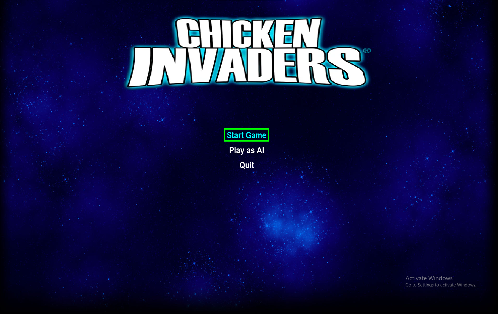

# fera5-invaders

## Overview

Fera5 Invaders is an arcade-style shooting game where players control a spaceship to fend off waves of invading fera5 from outer space. This project also includes an AI component that learns to play the game using reinforcement learning techniques.

## Features

- Classic shoot 'em up gameplay with increasing difficulty.
- Collect power-ups to enhance your weapons.
- Engaging graphics and sound effects.
- AI agent that learns to play the game through training.

## Getting Started

### Prerequisites

Make sure you have Python 3.x installed on your machine. You will also need to install the required libraries listed in 'requirements.txt'

### Installation

1. Clone the repository:

````bash
git clone https://github.com/yourusername/fera5-invaders.git
cd fera5-invaders
````

2. Install the required packages:

```bash
pip install -r requirements.txt
````

3. To run the game, run:

```bash
python3 src/ai/training.py

````
## AI Training
The AI uses Deep Q-Learning (DQN), a reinforcement learning algorithm, to master the game. It trains by interacting with the environment, storing experiences, and learning from rewards to make smarter decisions over time. The model improves through trial and error, ultimately achieving optimal gameplay strategies.

## Contributing
Contributions are welcome! If you’d like to improve the game or AI model, feel free to submit a pull request.

# [🎥 Watch the Video](https://studentaast-my.sharepoint.com/personal/r_saleh17871_student_aast_edu/_layouts/15/stream.aspx?id=%2Fpersonal%2Fr%5Fsaleh17871%5Fstudent%5Faast%5Fedu%2FDocuments%2FFera5InvadersMedia%2FVID%2D20250219%2DWA0018%2Emp4&referrer=StreamWebApp%2EWeb&referrerScenario=AddressBarCopied%2Eview%2E83232534%2Dd553%2D4b26%2Dabf2%2De2289b92e64b)




